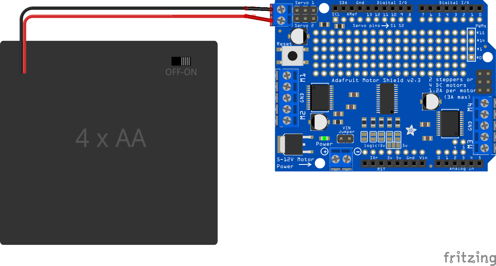

# motorShieldAndBluefruit

## Combining the Adafruit Motor Shield V2 for Arduino with the Adafruit Bluefruit LE SPI Friend

### If you have not already done so, install the library for the Motor Shield:
1. In Arduino, select **Sketch**, **Include Library**, and then **Manage
Libraries**

2. In the search space type **adafruit motor shield v2**

3. Click in the "Adafruit Motor Shield V2 Library" line and an **Install** button
will appear. Click the **Install** button.

4. Close the Library Manager window

### First make sure that no pins conflict. Studying the documentation, we find that:

* Adafruit Motor Shield V2 uses the two I2C pins (SCA and SDL). On an Arduino
Uno these are on pins A4 and A5. If you plan to attach servo motors to the
shield, this uses pins 9 and 10 additionally.

* Adafruit Bluefruit LE SPI Friend uses SPI. According to the [wiring
	diagram](https://learn.adafruit.com/introducing-the-adafruit-bluefruit-spi-breakout/wiring)
  the default wiring would use pins 4, 7, 8, 11, 12, and 13. (This can be
	changed, see the documentation)

### Construction

You can mount a header for the Bluefruit module in the prototyping area of 
the motor shield (image TBA)

### Software

For a code example, see [this example](motorShieldAndBluefruit/motorShieldAndBluefruit.ino)

### Changing the name of your Bluefruit Friend

If there are many similar devices, you might find it useful to change the 
name of your Bluetooth module:

1. In the Arduino Coding Environment, go to
```File->Examples->Adafruit Bluetooth nRF51->atcommand```

2. Upload to Arduino, then go to serial monitor

3. Type ```AT+GAPDEVNAME=x```, where ```x``` is the new name. 
Note that this is case sensitive (capitolization matters),
and that there must be no spaces.
Type this in the top section of the serial monitor, 
then press send. You should see an ```OK```.

4. Type in ATZ and click send. You should see another ```OK```.

5. The name should now be changed, the Arduino example will issue a factory
reset which will erase the name. To prevent the factory reset,

Find the phrase ```FACTORYRESET_ENABLE``` which will look like this:

#define FACTORYRESET_ENABLE 1  
#define MINIMUM_FIRMWARE_VERSION "0.6.6"  
#define MODE_LED_BEHAVIOUR "MODE"  

Change the 1 to a 0, and this disables factory reset. 

### Providing separate power for servo motors

Adafruit has made it easy to provide separate power to the servo
motors:

1. Carefully cut the 5V trace where indicated on the back of the motor shield.
To make sure there are no slivers of copper remaining, I like to remove a 
small length of copper that I can actually see:


2. Install screw terminals in the holes, or solder wires from a 6V battery
pack directly, to the indicated holes. 
Make sure the polarity is correct: **red** is
**positive** and **black** is **negative**:



*Note 1*: This provides power to the two servo headers that are pre-installed
on the shield (labelled Servo 1 and Servo 2.)
If you add more headers for more servo motors, 
you will need to add your own connection to this new power connector. 
The ground pin can be the same as the Arduino ground, 
since all grounds are common, 
and the the middle pin (the 5V pin)
should be connected to the middle pin of either of the two 
pre-installed servo headers
(which are now connected to this new power connector).

*Note 2*: The power to the servo motors is separate from the power to the DC
motors. This means more battery packs, and it allows you to have a different
voltage for the DC motors than the servo motors.


[5](images/bluefruit20170325_172730.jpg)
[6](images/bluefruit20170325_173409.jpg)
[7](images/bluefruit20170325_175137.jpg)
[8](images/bluefruit20170325_180755.jpg)
[9](images/bluefruit20170325_181214.jpg)
[10](images/bluefruit20170325_181219.jpg)
[11](images/bluefruit20170325_181220.jpg)
[12](images/bluefruit20170325_181322.jpg)
[13](images/bluefruit20170325_181324.jpg)
[14](images/bluefruit20170325_181325.jpg)
[15](images/bluefruit20170325_181512.jpg)
[16](images/bluefruit20170325_181513.jpg)
[17](images/bluefruit20170325_181514.jpg)
[18](images/bluefruit20170325_181623.jpg)
[19](images/bluefruit20170325_181627.jpg)
[20](images/bluefruit20170325_181628.jpg)
[21](images/bluefruit20170325_181631.jpg)
[22](images/bluefruit20170325_181632.jpg)
[23](images/bluefruit20170325_181635.jpg)
[24](images/bluefruit20170325_182123.jpg)
[25](images/bluefruit20170325_182124.jpg)
[26](images/bluefruit20170325_182126.jpg)
[27](images/bluefruit20170325_182933_Burst01.jpg)
[28](images/bluefruit20170325_182933_Burst02.jpg)
[29](images/bluefruit20170325_182938.jpg)
[30](images/bluefruit20170325_182948.jpg)
[31](images/bluefruit20170325_182954.jpg)
[32](images/bluefruit20170325_182958.jpg)
[33](images/bluefruit20170325_190521.jpg)
[34](images/bluefruit20170325_190525.jpg)
[35](images/bluefruit20170325_190528.jpg)
[36](images/bluefruit20170325_190529.jpg)
[37](images/bluefruit20170325_190530.jpg)
[38](images/bluefruit20170325_190532.jpg)
[39](images/bluefruit20170325_190628.jpg)
[40](images/bluefruit20170325_190629.jpg)
[41](images/bluefruit20170325_190631.jpg)
[42](images/bluefruit20170325_191058.jpg)
[43](images/bluefruit20170325_191104.jpg)
[44](images/bluefruit20170325_191105.jpg)
[45](images/bluefruit20170325_191108.jpg)
[46](images/bluefruit20170325_191214_HDR.jpg)
[47](images/bluefruit20170325_191217_HDR.jpg)
[48](images/bluefruit20170325_191220_HDR.jpg)
[49](images/bluefruit20170325_191224_HDR.jpg)
[50](images/bluefruit20170325_191228_HDR.jpg)
[51](images/bluefruit20170328_100052.jpg)
[52](images/bluefruit20170328_100058.jpg)
[53](images/bluefruit20170328_100110.jpg)
[54](images/bluefruit20170328_100112.jpg)
[55](images/bluefruit20170328_100119.jpg)
[56](images/bluefruit20170328_100124.jpg)
[57](images/bluefruit20170328_100129.jpg)
[58](images/bluefruit20170328_100136.jpg)
[59](images/bluefruit20170328_100144.jpg)
[60](images/bluefruit20170328_180312.jpg)
[61](images/bluefruit20170328_180316.jpg)
[62](images/bluefruit20170328_180339.jpg)
[63](images/bluefruit20170328_180341.jpg)
[64](images/bluefruit20170917_184741.jpg)
[65](images/bluefruit20170917_184802_Burst01.jpg)
[66](images/bluefruit20170917_184802_Burst02.jpg)
[67](images/bluefruit20170917_184805.jpg)
[68](images/bluefruit20170917_184948.jpg)
[69](images/bluefruit20170917_185540.jpg)
[70](images/bluefruit20170917_185558.jpg)
[71](images/bluefruit20170918_100330.jpg)
[72](images/bluefruit20170918_100347.jpg)
[73](images/bluefruit20170918_102305.jpg)
[74](images/bluefruit20170918_102338.jpg)
[75](images/bluefruit20170918_102450.jpg)
[76](images/bluefruit20170918_102504.jpg)
[77](images/bluefruit20170918_105335.jpg)
[78](images/bluefruit20170918_105901.jpg)
[79](images/bluefruit20170918_105907.jpg)
[80](images/bluefruit20170918_105914.jpg)
[81](images/bluefruit20170918_110016.jpg)
[82](images/bluefruit20170918_110023.jpg)
[83](images/bluefruit20170918_110147.jpg)
[84](images/bluefruit20170918_110204.jpg)
[85](images/bluefruit20170918_110225.jpg)
[86](images/bluefruit20170918_110227.jpg)
[87](images/bluefruit20170918_110305.jpg)
[88](images/bluefruit20170918_110334.jpg)
[89](images/bluefruit20170918_110440.jpg)
[90](images/bluefruit20170918_110458.jpg)
[91](images/bluefruit20170918_111024.jpg)
[92](images/bluefruit20170918_111311.jpg)
[93](images/bluefruit20170918_111451.jpg)
[94](images/bluefruit20170918_111455.jpg)
[95](images/bluefruit20170918_115559.jpg)
[96](images/bluefruit20170918_120643.jpg)
[97](images/bluefruit20170918_130348_HDR.jpg)
[98](images/bluefruit20170918_130353.jpg)
[99](images/bluefruit20170918_130531_HDR.jpg)
[100](images/bluefruit20170918_130607.jpg)
[101](images/bluefruit20170918_130643.jpg)
[102](images/bluefruit20170918_130711.jpg)
[103](images/bluefruit20170918_131136.jpg)
[104](images/bluefruit20170918_131201.jpg)
[105](images/bluefruit20170918_131212.jpg)
[106](images/bluefruit20170918_131239.jpg)
[107](images/bluefruit20170918_131353.jpg)
[108](images/bluefruit20170918_131446.jpg)
[109](images/bluefruit20170918_131531.jpg)
[110](images/bluefruit20170918_131630.jpg)
[111](images/bluefruit20170918_131706.jpg)
[112](images/bluefruit20170918_131832.jpg)
[113](images/bluefruit20170918_131955.jpg)
[114](images/bluefruit20170918_132107.jpg)
[115](images/bluefruit20170918_132219.jpg)
[116](images/bluefruit20170918_132241.jpg)
[117](images/bluefruit20170918_132301.jpg)
[118](images/bluefruit20170918_132315.jpg)
[119](images/bluefruit20170918_132342.jpg)
[120](images/bluefruit20170918_132417.jpg)
[121](images/bluefruit20170918_132428.jpg)
[122](images/bluefruit20170918_132503.jpg)
[123](images/bluefruit20170918_132543.jpg)
[124](images/bluefruit20170918_132601.jpg)
[125](images/bluefruit20170918_135916.jpg)
[126](images/bluefruit20170918_140003.jpg)
[127](images/bluefruit20170918_140041.jpg)
[128](images/bluefruit20170918_140103.jpg)
[129](images/bluefruit20170918_140118.jpg)
[130](images/bluefruit20170918_140253.jpg)
[131](images/bluefruit20170918_140337_HDR.jpg)
[132](images/bluefruit20170918_140347.jpg)
[133](images/bluefruit20170918_140407.jpg)
[134](images/bluefruit20170918_140614.jpg)
[135](images/bluefruit20170918_140629.jpg)
[136](images/bluefruit20170918_140658.jpg)
[137](images/bluefruit20170918_140755_HDR.jpg)
[138](images/bluefruit20170918_140845_HDR.jpg)
[139](images/bluefruit20170918_141004.jpg)
[140](images/bluefruit20170918_141930.jpg)
[141](images/bluefruit20170918_142015.jpg)
[142](images/bluefruit20170918_142142.jpg)
[143](images/bluefruit20170918_142218.jpg)
[144](images/bluefruit20170918_142537.jpg)
[145](images/bluefruit20170918_142608.jpg)
[146](images/bluefruit20170918_142731.jpg)
[147](images/bluefruit20170918_142826.jpg)
[148](images/bluefruit20170918_143153.jpg)
[149](images/bluefruit20170918_143208.jpg)
[150](images/bluefruit20170918_143448.jpg)
[151](images/bluefruit20170918_161405.jpg)
[152](images/bluefruit20170918_161433.jpg)
[153](images/bluefruit20170918_161451.jpg)
[154](images/bluefruit20170918_161513.jpg)
[155](images/bluefruit20170918_211859.jpg)
[156](images/bluefruit20170918_211908.jpg)
[157](images/bluefruit20170918_211933.jpg)
[158](images/bluefruitfoo)
