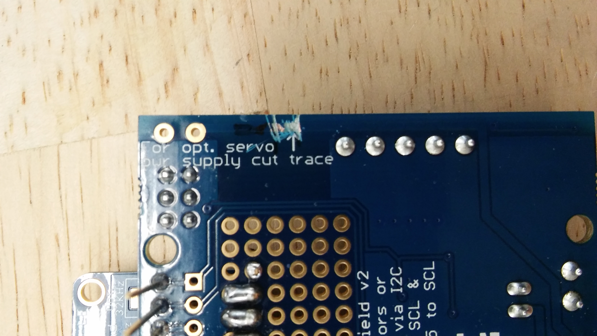
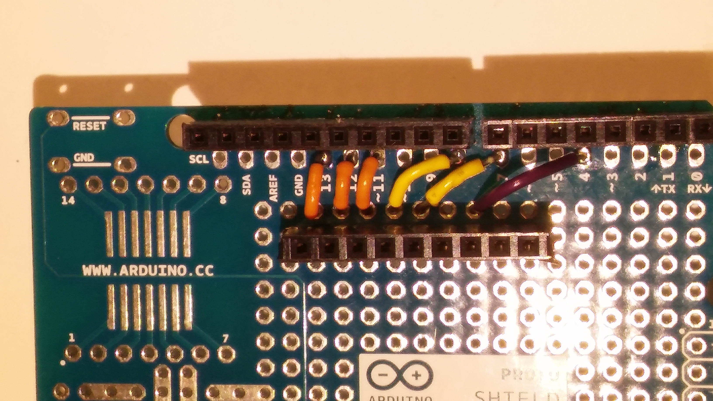
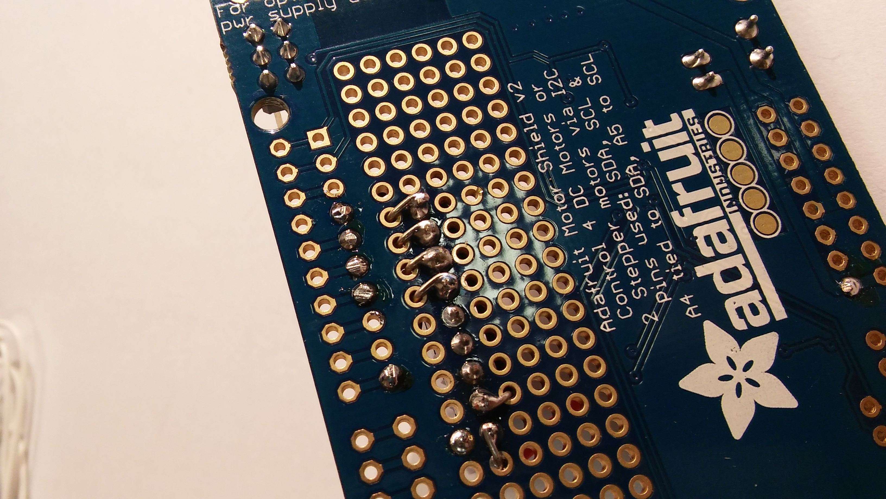

# motorShieldAndBluefruit

## Combining the Adafruit Motor Shield V2 for Arduino with the Adafruit Bluefruit LE SPI Friend

### If you have not already done so, install the library for the Motor Shield:
1. In Arduino, select **Sketch**, **Include Library**, and then **Manage
Libraries**

2. In the search space type **adafruit motor shield v2**

3. Click in the "Adafruit Motor Shield V2 Library" line and an **Install** button
will appear. Click the **Install** button.

4. Close the Library Manager window

### First make sure that no pins conflict. Studying the documentation, we find that:

* Adafruit Motor Shield V2 uses the two I2C pins (SCA and SDL). On an Arduino
Uno these are on pins A4 and A5. If you plan to attach servo motors to the
shield, this uses pins 9 and 10 additionally.

* Adafruit Bluefruit LE SPI Friend uses SPI. According to the [wiring
	diagram](https://learn.adafruit.com/introducing-the-adafruit-bluefruit-spi-breakout/wiring)
  the default wiring would use pins 4, 7, 8, 11, 12, and 13. (This can be
	changed, see the documentation)

### Construction

Start by drawing a schematic. As you read, there are many options, but
it's usually a good idea to start with the default unless you have a 
good reason to do differently.

I started with
[this](https://learn.adafruit.com/introducing-the-adafruit-bluefruit-spi-breakout/wiring#default-pinout)
table in the Adafruit guide. Note that they don't list the DFU pin (since it
isn't used) but I added it to my schematic to remind me not to use it:


You can mount a header for the Bluefruit module in the prototyping area of 
the motor shield 

Think about where you want the module to sit. Since some of the wires
connect directly to pins 13, 12, and 11, it might be convenient to put it 
nearby. Leave room for making your connections. I left only one row, you might
want to leave more so that it's not so tight. Put the header 
and Bluetooth module in loosely while you experiment to
help you visualize:


Before you start soldering, draw a diagram of how you will make the 
connections. Think about where the wires will go. 

Remember that the holes next to the Arduino pins are automatically connected
to the Arduino pins, but the holes next to your header will not automatically
connect to the header. You must make this connection yourself by folding the 
wire on the back side of the board and soldering it to the header pin


Solder in the female header


Before you start soldering the wires in place, think about the order.
Will any wires block holes 
that you later need access to? 

Wire colors are very important! Always use red for 5V and black for ground (or
GND). Don't use these colors for any other connections.

Wire choice is important too: Use 22 AWS solid core wire.

I decided to start with GND and 5V


Don't try to wrap the wires around the pins of the header. There isn't room.
Just bend the wire a little bit to hold it in place while you solder it.


After soldering the wire to the header pin,
cut off the excess very close to the pin. Don't be afraid to take
some solder with it:


Now the 5V wire:


After every step compare what you have done with the original table (not your
schematic or diagram in case you made a mistake there). Plug in the module
and check that the labels on the module corresponds to the pins you are 
connecting.

If others are near you, ask them to double check your work, and offer to 
check theirs in return.

Then I added the three that are in a row: pins 13, 12, and 11:

(picture)

Then CS

(picture)

At this point I realized that the wire from IRQ to pin 7 might
cover the hole next to RST, so I did the wire to RST before the wire 
to IRQ.

(picture)

and finally the wire to IRQ:

(picture)

### Software

For a code example, see [this example](motorShieldAndBluefruit/motorShieldAndBluefruit.ino)

### Changing the name of your Bluefruit Friend

If there are many similar devices, you might find it useful to change the 
name of your Bluetooth module:

1. In the Arduino Coding Environment, go to
```File->Examples->Adafruit Bluetooth nRF51->atcommand```

2. Upload to Arduino, then go to serial monitor

3. Type ```AT+GAPDEVNAME=x```, where ```x``` is the new name. 
Note that this is case sensitive (capitolization matters),
and that there must be no spaces.
Type this in the top section of the serial monitor, 
then press send. You should see an ```OK```.

4. Type in ATZ and click send. You should see another ```OK```.

5. The name should now be changed, the Arduino example will issue a factory
reset which will erase the name. To prevent the factory reset,

Find the phrase ```FACTORYRESET_ENABLE``` which will look like this:

#define FACTORYRESET_ENABLE 1  
#define MINIMUM_FIRMWARE_VERSION "0.6.6"  
#define MODE_LED_BEHAVIOUR "MODE"  

Change the 1 to a 0, and this disables factory reset. 

### Providing separate power for servo motors

Adafruit has made it easy to provide separate power to the servo
motors:

1. Carefully cut the 5V trace where indicated on the back of the motor shield.
To make sure there are no slivers of copper remaining, I like to remove a 
small length of copper that I can actually see:



2. Install screw terminals in the holes, or solder wires from a 6V battery
pack directly, to the indicated holes. 
Make sure the polarity is correct: **red** is
**positive** and **black** is **negative**:


*Note 1*: This provides power to the two servo headers that are pre-installed
on the shield (labelled Servo 1 and Servo 2.)
If you add more headers for more servo motors, 
you will need to add your own connection to this new power connector. 
The ground pin can be the same as the Arduino ground, 
since all grounds are common, 
and the the middle pin (the 5V pin)
should be connected to the middle pin of either of the two 
pre-installed servo headers
(which are now connected to this new power connector).

*Note 2*: The power to the servo motors is separate from the power to the DC
motors. This means more battery packs, and it allows you to have a different
voltage for the DC motors than the servo motors.








